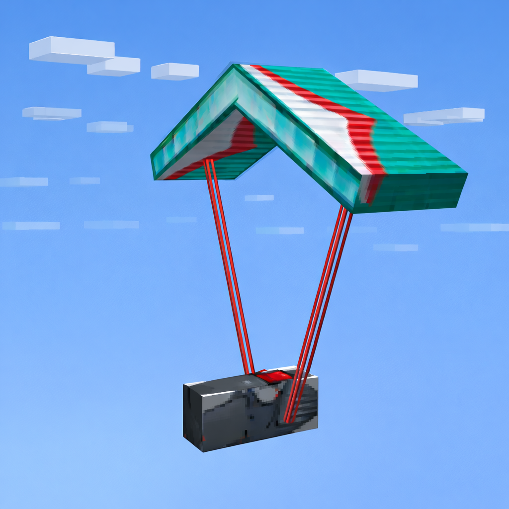

# Paragliding Simulator (Fabric)

[Read in English](README.md)



Mod de Minecraft (Fabric) que anade **parapente realista**, termicas y zonas de despegue, con un sistema de viento dinamico.  
Basado en el mod **Skydiving Mod** de tgskiv, ampliado con parapente, termicas y worldgen.

---

## Caracteristicas

- **Parapente** con fisica de vuelo propia y controlable.
- **Fisica de vuelo realista**: el viento afecta tu velocidad y deriva. *(original del mod Skydiving Mod)*
- **Viento dinamico**: direccion y velocidad cambian gradualmente. *(original del mod Skydiving Mod)*
- **Pronostico de viento** con cambios futuros. *(original del mod Skydiving Mod)*
- **Sincronizacion de viento servidor-cliente**. *(original del mod Skydiving Mod)*
- **Manga de viento** para comprobar direccion. *(original del mod Skydiving Mod)*
- **Termicas**: corrientes ascendentes con nubes visibles.
- **Despegues (estructuras)**: puntos naturales de lanzamiento en montanas y zonas altas.
- **HUD y sonidos de vario/casco** configurables.

Nota: en el mod original el viento afecta el vuelo con elytras; en este mod ese efecto se ha reducido para dar mas protagonismo al vuelo en parapente.

---

## Requisitos

- **Minecraft** 1.21.2
- **Fabric Loader** 0.16.14
- **Fabric API** (obligatorio)

Opcionales recomendados:
- **Mod Menu** (muestra el boton Mods y accesos directos)
- **Cloth Config** (si quieres abrir la pantalla de configuracion completa)

---

## Instalacion

1. Instala Fabric Loader para 1.21.2.
2. Coloca el .jar del mod en `.minecraft/mods`.
3. Instala Fabric API (y Mod Menu/Cloth Config si deseas ajustes avanzados).
4. Inicia Minecraft.

---

## Que anade el mod

Items principales:
- **Parapente**: permite volar con estilo realista.
- **Casco de vuelo**: muestra HUD y permite configurar el mod.
- **Vario**: instrumento de sonido para ascensos/descensos.
- **Manga de viento**: indica direccion del viento. *(original del mod Skydiving Mod)*
- **Poster/libro**: guia rapida de vuelo.

---

## Crafteos y primeros pasos

- Consulta recetas con **REI/JEI/EMI**.
- Fabrica primero la **manga de viento** para aprender direccion del viento.
- Prepara el **casco** o **vario** para recibir feedback de ascensos/descensos.
- Craftea el **parapente** y despega desde lugares altos.
- Opcional: busca **despegues** en las montanas.

---

## Controles basicos en vuelo

- **Acelerar**: mas velocidad, mas descenso.
- **Frenar**: reduce velocidad, menos descenso.
- **Girar**: ajusta rumbo para alinearte con el viento.
- **Barrena**: maniobra de descenso rapido (usala con cuidado).

Consejos:
- Despega siempre **de cara al viento**.
- Evita barrena cerca del suelo.
- Busca laderas a barlovento y termicas para ganar altura.

---

## Estructuras de despegue (worldgen)

- Se generan en terreno montanoso/alto.
- En el encontraras una manga de viento, un poster didactico y un cofre.
- Si no encuentras uno, puedes usar `/locate` o el comando de prueba del mod (si tienes permisos).

---

## Termicas

- Las termicas son columnas de aire ascendente.
- Producen pequenas nubes en su parte mas alta.
- El tamano de la nube depende del tamano y potencia de la termica.
- Cada dia hay una variacion aleatoria en el tamano y altura maxima de las termicas.
- Hay presets de **cantidad**, **intensidad**, **altura** y **tamano**.
- Configurable para rendimiento o realismo.

---

## Configuracion

Tienes dos formas de abrir el menu:

1. **Desde el casco de vuelo**: en su menu aparece el boton **"Config. mod"**.
2. **Desde Mod Menu** (si lo tienes instalado): boton "Mods" del menu principal.

Si no tienes Cloth Config instalado, el boton avisara en el chat.

---

## Comandos utiles

| Comando | Descripcion |
| --- | --- |
| `/wind forecast` | Ver los proximos 5 cambios de viento *(original del mod Skydiving Mod)* |
| `/wind again` | Regenerar pronostico *(original del mod Skydiving Mod)* |
| `/wind hud true/false` | HUD debug de viento *(original del mod Skydiving Mod)* |

---

## Rendimiento y compatibilidad

- Aumentar cantidad de termicas o distancia de generacion puede reducir FPS.
- Si falta el boton Mods, instala **Mod Menu**.
- Si fallan ajustes del menu, instala **Cloth Config**.

---

## Desarrollo (solo para devs)

Requisitos:
- Java 21
- Gradle 8

Build:

```bash
./gradlew build
```

El .jar generado queda en `build/libs/`.

---

## Licencia

Este repositorio se distribuye bajo **MIT** (ver `LICENSE`).

---

## Creditos

- Basado en **Skydiving Mod** de **tgskiv**: https://github.com/tgskiv/skydiving-mod-fabric
- Codigo original (viento, pronostico, manga y sincronizacion) proviene de ese proyecto.
- Este mod amplia el sistema con parapente, termicas, despegues y gameplay asociado.

